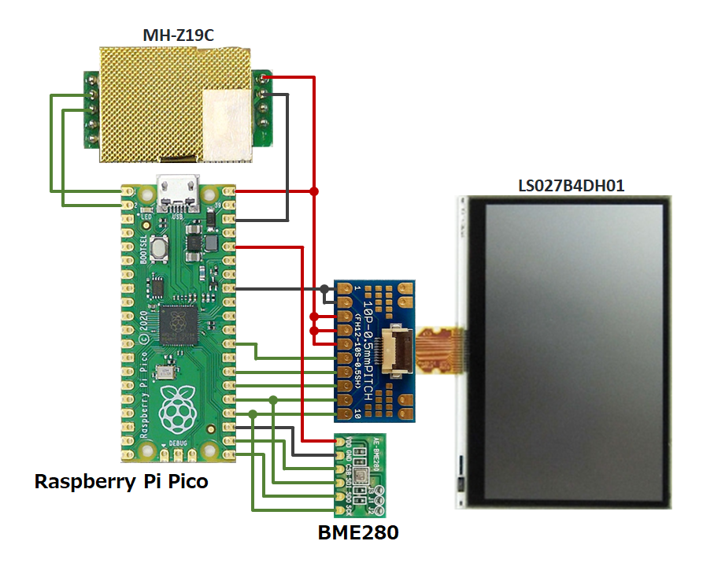

# pico-env-mon

秋月電子で買える部品でできる環境モニタです。

温度、湿度、気圧、CO2濃度を 5秒間隔で取得し、24時間のトレンドグラフとともに表示します。

ディスプレイは発光しないので寝室等でも使用できます。

----

## 作例

3Dプリンタで作ったケースに収めた例です。


----

## 使用部品

- [Raspberry Pi Pico](https://akizukidenshi.com/catalog/g/gM-16132/)
- [シャープ モノクロHR-TFTメモリ液晶モジュール (LS027B4DH01)](https://akizukidenshi.com/catalog/g/gP-04944/)
- [フレキコネクタDIP化キット(AE-CNCONV-10P-0.5)](https://akizukidenshi.com/catalog/g/gK-07253/)
- [BME280使用　温湿度・気圧センサモジュールキット (AE-BME280)](https://akizukidenshi.com/catalog/g/gK-09421/)
- [CO2センサーモジュール MH-Z19C](https://akizukidenshi.com/catalog/g/gM-16142/)
    - ピンヘッダが付いていますが 2.54mmピッチのユニバーサル基板には適合しません。1.27mmピッチのユニバーサル基板を使用するか、ピンヘッダを使用せずに配線してください。
- [分割ロングピンソケット 1x42(42P)](https://akizukidenshi.com/catalog/g/gC-05779/)
- その他
    - ユニバーサル基板
    - 配線類
    - microUSBケーブル (書き込み/電源供給)

----

## 接続

|Pico|LS027B4DH01|BME280|MH-Z19C|
|:--|:--|:--|:--|
|`VBUS`|`VDD`, `VDDA`, `EXTMODE`||`Vin`|
|`3V3`||`VDD`||
|`GND`|`VSS`, `VSSA`|`GND`|`GND`|
|`GPIO0` (uart0 TX)|||`RX`|
|`GPIO1` (uart1 RX)|||`TX`|
|`GPIO16` (spi0 RX)||`SDO`|
|`GPIO17` (spi0 CSn)||`CSB`|
|`GPIO18` (spi0 SCLK)|`SCLK`|`SCK`|
|`GPIO19` (spi0 TX)|`SI`|`SDI`|
|`GPIO20`|`SCS`||
|`GPIO21`|`EXTCOMIN`||
|`GPIO22`|`DISP`||



----

## プログラム

### バイナリ

1. [Releases](https://github.com/shapoco/pico-env-mon/releases) から `pico_env_mon_x.x.zip` をダウンロードし、展開します。
2. Raspberry Pi Pico の `BOOT SEL`ボタンを押しながら USBケーブルを接続し、書き込みモードにします。
3. `pico_env_mon.uf2` を Raspberry Pi Pico に書き込みます。

### ソースコードからのビルド

ビルドするには Raspberry Pi Pico SDK が必要です。インストール方法はググってください。Windows の場合は WSL2上にインストールすることをお勧めします。

1. 本リポジトリを clone して次のコマンドを実行します。

    ```sh
    mkdir build
    cd build
    cmake ..
    make
    ```

    - Linux の場合は次のコマンドでもビルドできます。

        ```sh
        make -f Makefile.sample.mk
        ```

2. Raspberry Pi Pico の `BOOT SEL`ボタンを押しながら USBケーブルを接続し、書き込みモードにします。
3. `build/pico_env_mon.uf2` を Raspberry Pi Pico に書き込みます。

----

## 調整

### BME280 の温度

BME280 で取得できる温度の値は湿度と気圧の補正のためのもので、実際の気温より数度程度高くなります。このため、本プロジェクトではデフォルトでは取得した温度から 3.0℃ 減算した値を表示しています。

参考 : [第28回 温湿度・気圧センサ(BME280) 〜仕様概要〜 | ツール・ラボ](https://tool-lab.com/pic-practice-28/)

実際の気温とどの程度乖離するかはセンサの使用条件によります。ケースに入れたり、BME280 を CO2センサに近接させたりすると乖離が大きくなります。

補正値を変更するには、`src/pico_env_mon.cpp` の次の箇所を変更してビルドし直してください。

```c++
static const float TEMPERATURE_OFFSET = -3.0f;
```

### MH-Z19C のキャリブレーション

MH-Z19C は初期状態では正しい値を示さないケースがあるようです。

参考 : [Home Assistant: ESP32+MH-Z19CでCO2モニター構築(2) [キャリブレーション編] - Sympapaのスマートホーム日記](https://sympapa.hatenablog.com/entry/2022/06/05/091621)

誰もいない風通しの良い場所に放置して値が 400ppm 付近まで下がらない場合はキャリブレーションを実施してください。

1. 本機を誰もいない風通しの良い場所に 20分間放置します。
2. 吐息がかからないように息を止めて、Zero Point Calibrationスイッチを 7秒間押下します。

なお、本プロジェクトではオートキャリブレーションは無効化されています。

----
