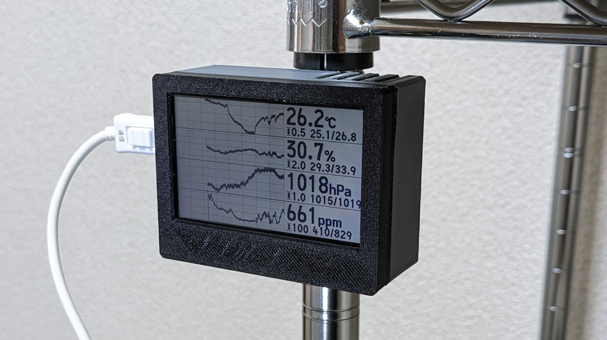
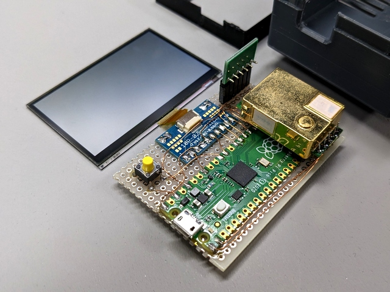
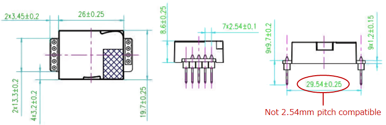
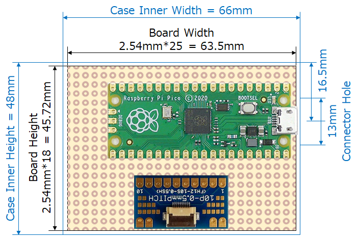

# pico-env-mon

~~秋月電子だけ~~ ネットで買える部品でできる環境モニタです。

温度、湿度、気圧、CO2濃度を 5秒間隔で取得し、24時間のトレンドグラフとともに表示します。

反射型のディスプレイなので寝室等でも眩しくありません。

----

## 作例

3Dプリンタで作ったケースに収めた例です。





----

## 使用部品

- ⛔ : 2024/11/10 現在売り切れ
- ❓ : 使用実績なし、動作未確認。購入前によくご確認ください

<table>
  <tr>
    <th>項目</th>
    <th>型番・仕様</th>
    <th>購入先 (例)</th>
    <th>備考</th>
  </tr>
  <tr>
    <td>マイコン</td>
    <td>Raspberry Pi Pico<br>(RP2040)</td>
    <td>
      秋月: <a href="https://akizukidenshi.com/catalog/g/g116132/" target="_blank">116132</a>
    </td>
    <td></td>
  </tr>
  <tr>
    <td rowspan="3">LCD<br>(右のいずれか)</td>
    <td>LS027B7DH01</td>
    <td>
      DigiKey: <a href="https://www.digikey.jp/ja/products/detail/sharp-microelectronics/LS027B7DH01/5054066" target="_blank">425-2907-ND</a>
    </td>
    <td rowspan="2">*1</td>
  </tr>
  <tr>
    <td>LS027B7DH01A</td>
    <td>
      DigiKey: <a href="https://www.digikey.jp/ja/products/detail/sharp-microelectronics/LS027B7DH01A/5054067" target="blank">425-2908-ND</a>
    </td>
  </tr>
  <tr>
    <td>LS027B4DH01</td>
    <td>
      秋月(単品): <a href="https://akizukidenshi.com/catalog/g/g104944/" target="blank">104944</a>⛔<br>
      秋月(キット): <a href="https://akizukidenshi.com/catalog/g/g106875/" target="blank">106875</a><br>
      スイッチサイエンス: <a href="https://www.switch-science.com/products/1607" target="blank">1607</a>⛔<br>
      共立: <a href="https://eleshop.jp/shop/g/gN1BSC7/" target="blank">N1BSC7</a>⛔
    </td>
    <td></td>
  </tr>
  <tr>
    <td rowspan="2">LCD 用コネクタ<br>ブレイクアウトボード<br>(右のいずれか)</td>
    <td>AE-CNCONV-10P-0.5</td>
    <td>
      秋月: <a href="https://akizukidenshi.com/catalog/g/g107253/" target="blank">107253</a>⛔
    </td>
    <td></td>
  </tr>
  <tr>
    <td>EPA0139</td>
    <td>
      楽天: <a href="https://item.rakuten.co.jp/techspace/201808epa0139/" target="blank">201808epa0139</a>❓<br>
      Amazon: <a href="https://www.amazon.co.jp/dp/B07H2FTQJM" target="blank">B07H2FTQJM</a>❓<br>
      Aliexpress <a href="https://ja.aliexpress.com/w/wholesale-epa0139.html" target="blank">検索</a>❓
    </td>
    <td></td>
  </tr>
  <tr>
    <td>温湿度・気圧センサ</td>
    <td>AE-BME280</td>
    <td>
      秋月: <a href="https://akizukidenshi.com/catalog/g/g109421/" target="blank">109421</a>
    </td>
    <td></td>
  </tr>
  <tr>
    <td>CO2 センサ</td>
    <td>MH-Z19C</td>
    <td>
      秋月: <a href="https://akizukidenshi.com/catalog/g/g116142/" target="blank">116142</a>
    </td>
    <td>*2</td>
  </tr>
  <tr>
    <td>ゼロ点補正スイッチ</td>
    <td>適当なタクトスイッチ</td>
    <td>
      秋月: <a href="https://akizukidenshi.com/catalog/c/cpushsw/" target="blank">検索</a>
      (例: <a href="https://akizukidenshi.com/catalog/g/g103647/" target="blank">103647</a>)
    </td>
    <td></td>
  </tr>
  <tr>
    <td rowspan="2">バイパスコンデンサ</td>
    <td>セラミック 0.1uF</td>
    <td>
      秋月: <a href="https://akizukidenshi.com/catalog/goods/search.aspx?ct=02020101&goods_specification=0.1%CE%BCF&search=%E6%A4%9C%E7%B4%A2%E3%81%99%E3%82%8B" target="blank">検索</a>
      (例: <a href="https://akizukidenshi.com/catalog/g/g113582/" target="blank">113582</a>)
    </td>
    <td></td>
  </tr>
  <tr>
    <td>セラミック 1uF</td>
    <td>
      秋月: <a href="https://akizukidenshi.com/catalog/goods/search.aspx?ct=02020101&goods_specification=1%CE%BCF&search=%E6%A4%9C%E7%B4%A2%E3%81%99%E3%82%8B" target="blank">検索</a>
      (例: <a href="https://akizukidenshi.com/catalog/g/g115874/" target="blank">115874</a>)
    </td>
    <td></td>
  </tr>
  <tr>
    <td>ノイズ対策用<br>追加コンデンサ</td>
    <td>電解コンデンサ 47uF</td>
    <td>
      秋月: <a href="https://akizukidenshi.com/catalog/goods/search.aspx?ct=02020102&goods_specification=47%CE%BCF&search=%E6%A4%9C%E7%B4%A2%E3%81%99%E3%82%8B" target="blank">検索</a>
      (例: <a href="https://akizukidenshi.com/catalog/g/g110270/" target="blank">110270</a>)
    </td>
    <td></td>
  </tr>
  <tr>
    <td>センサ固定用<br>ピンヘッダ</td>
    <td>FHU-1x42SG</td>
    <td>
      秋月: <a href="https://akizukidenshi.com/catalog/g/g105779/" target="blank">105779</a>
    </td>
    <td></td>
  </tr>
  <tr>
    <td rowspan="2">ユニバーサル基板<br>(右のいずれか)</td>
    <td>秋月Bタイプ 2.54mm</td>
    <td>
      秋月: <a href="https://akizukidenshi.com/catalog/goods/search.aspx?search=x&keyword=%E3%83%A6%E3%83%8B%E3%83%90%E3%83%BC%E3%82%B5%E3%83%AB%E5%9F%BA%E6%9D%BF+B%E3%82%BF%E3%82%A4%E3%83%97+2.54mm&search=search" target="blank">検索</a>
      (例: <a href="https://akizukidenshi.com/catalog/g/g100181/" target="blank">100181</a>)
    </td>
    <td rowspan="2">*2, *3</td>
  </tr>
  <tr>
    <td>秋月Bタイプ 1.27mm</td>
    <td>
      秋月: <a href="https://akizukidenshi.com/catalog/goods/search.aspx?search=x&keyword=%E3%83%A6%E3%83%8B%E3%83%90%E3%83%BC%E3%82%B5%E3%83%AB%E5%9F%BA%E6%9D%BF+B%E3%82%BF%E3%82%A4%E3%83%97+1.27mm&search=search" target="blank">検索</a>
      (例: <a href="https://akizukidenshi.com/catalog/g/g117829/" target="blank">117829</a>)
    </td>
  </tr>
  <tr>
    <td>配線類</td>
    <td>UEW など</td>
    <td>
      秋月: <a href="https://akizukidenshi.com/catalog/c/cwire/" target="blank">検索</a>
      (例: <a href="https://akizukidenshi.com/catalog/g/g109583/" target="blank">109583</a>)
    </td>
    <td></td>
  </tr>
  <tr>
    <td>USB電源</td>
    <td>5V</td>
    <td>
      秋月: <a href="https://akizukidenshi.com/catalog/g/g113658/" target="_blank">113658</a>
    </td>
    <td>*4</td>
  </tr>
  <tr>
    <td>microUSBケーブル</td>
    <td>通信用のもの</td>
    <td>
      秋月: <a href="https://akizukidenshi.com/catalog/g/g107607/" target="_blank">107607</a>
    </td>
    <td></td>
  </tr>
</table>

\*1) LS027B7DH01 と LS027B7DH01A の違い:

> フィックスAの付いている部品は、1つのディスプレイにつき最大2ピクセル（ドット抜け）の欠陥を許容しますが、サフィックスAの付いていない部品は1ピクセルの欠陥も許容しません。<br>
> [Sharp LS027B7DH01とLS027B7DH01Aの違いについて - 日本語フォーラム / 部品品番 - Electronic Component and Engineering Solution Forum - TechForum │ DigiKey](https://forum.digikey.com/t/sharp-ls027b7dh01-ls027b7dh01a/17466)

\*2) :warning: MH-Z19C には購入時点でピンヘッダが付いていてそれ自体は 2.54mm ピッチですが、2 つのヘッダの間隔が 2.54mm ピッチのユニバーサル基板に適合しません。1.27mm ピッチのユニバーサル基板を使用するか、ピンヘッダを外してスズメッキ線等で配線してください。



\*3) :warning: ケース用の STL データを使用する場合は適切な大きさにカットする必要があります (後述)。

\*4) :warning: 市販の一般的な USB-AC アダプタでかまいませんが、電圧が低いものや不安定なものだと LCD の動作が不安定になることがあります。

----

## 接続

|Pico|LS027B7DH01(A)<br>LS027B4DH01|BME280|MH-Z19C|
|:--|:--|:--|:--|
|`VBUS`|`VDD`, `VDDA`, `EXTMODE`<br>セラミック 1uF||`Vin`<br>セラミック 1uF (+ 電解 47uF)|
|`3V3`||`VDD`||
|`GND`|`VSS`, `VSSA`|`GND`|`GND`|
|`GPIO0` (uart0 TX)|||`RX`|
|`GPIO1` (uart1 RX)|||`TX`|
|`GPIO16` (spi0 RX)||`SDO`|
|`GPIO17` (spi0 CSn)||`CSB`|
|`GPIO18` (spi0 SCLK)|`SCLK`|`SCK`|
|`GPIO19` (spi0 TX)|`SI`|`SDI`|
|`GPIO20`|`SCS`||
|`GPIO21`|`EXTCOMIN`||
|`GPIO22`|`DISP`<br>セラミック 0.1uF||


----

## 配線・組み立てについて

### 注意事項

:warning: LCD のフレキケーブルは非常に破損しやすいので慎重に扱ってください。

:warning: CO2センサー MH-Z19C は内蔵された電球の駆動のために定期的に大きな電流を吸い込みます。これが LCD の動作に悪影響を与えないよう、配線の引き回しやコンデンサの配置に注意する必要があります。

- MH-Z19C と LCD の電源ラインは根元から別々に配線してください。
- MH-Z19C と LCD それぞれの直近にセラミックコンデンサを実装してください。
- これでも LCD の表示に問題が生じた場合は:
    - MH-Z19C の直近に電解コンデンサ 47uF を追加してみてください。
    - USB 電源の電圧が低すぎないか確認してみてください。

### ケースの STL について

[ケース用の STL のサンプル](stl/) を公開しています。2.54mm ピッチのユニバーサル基板を 24穴 x 17穴 にカットし、以下のようにレイアウトする前提の形状になっています。 基板を搭載する部分の内寸は 66 x 48mm です。



----

## プログラム

コンパイル済みバイナリをダウンロードしてそのまま書き込むか、またはソースコードからビルドしてください。

### コンパイル済みバイナリ

1. [Releases](https://github.com/shapoco/pico-env-mon/releases) から `pico_env_mon_x.x.zip` をダウンロードし、展開します。
2. Raspberry Pi Pico の `BOOT SEL`ボタンを押しながら USBケーブルを接続し、書き込みモードにします (USBストレージとして認識されます)。
3. `pico_env_mon.uf2` を Raspberry Pi Pico に書き込みます。

### ソースコードからのビルド

ビルドするには Raspberry Pi Pico SDK が必要です。インストール方法はググってください。Windows の場合は WSL2上にインストールすることをお勧めします。

1. 本リポジトリを clone し、リポジトリのディレクトリ内でビルドを実行します。

    ```sh
    git clone https://github.com/shapoco/pico-env-mon.git
    cd pico-env-mon
    mkdir build
    cd build
    cmake ..
    make
    ```

3. Raspberry Pi Pico の `BOOT SEL`ボタンを押しながら USBケーブルを接続し、書き込みモードにします (USBストレージとして認識されます)。
4. `pico-env-mon/build/pico_env_mon.uf2` を Raspberry Pi Pico に書き込みます。

----

## 調整

### BME280 の温度

BME280 で取得できる温度の値は湿度と気圧の補正のためのもので、実際の気温より若干高くなります。

> The integrated temperature sensor has been optimized for lowest noise and highest resolution. Its output is used for temperature compensation of the pressure and humidity sensors and can also be used for estimation of the ambient temperature. 

> Temperature measured by the internal temperature sensor. This temperature value depends on the PCB temperature, sensor element self-heating and ambient temperature and is typically above ambient temperature.

実際の気温とどの程度乖離するかはセンサの使用条件によります。ケースに入れたり、BME280 を CO2センサに近接させたりすると乖離が大きくなります。本プロジェクトではこれらを考慮し、デフォルトでは取得した温度から 1.5℃ 減算した値を表示します。

補正値を変更するには、`src/pico_env_mon.cpp` の次の箇所を変更してビルドし直してください。

```c++
static const float TEMPERATURE_OFFSET = -1.5f;
```

### MH-Z19C のキャリブレーション

MH-Z19C は初期状態では正しい値を示さないケースがあるようです。

屋外に放置して値が 400ppm 付近まで下がらない場合や、人がいる室内なのに 400ppm 付近に張り付いてしまう場合はキャリブレーションを実施してください。

参考: [Home Assistant: ESP32+MH-Z19CでCO2モニター構築(2) [キャリブレーション編] - Sympapaのスマートホーム日記](https://sympapa.hatenablog.com/entry/2022/06/05/091621)

1. 本機を屋外や誰もいない風通しの良い場所に 20分間放置します。
2. 吐息がかからないように息を止めて、ゼロ点補正 (Zero Point Calibration) スイッチを 7秒間押下します。

なお、本プロジェクトではオートキャリブレーションは無効化されています。

### 時間軸のスケール変更

デフォルトでは 24時間分のグラフが表示されます。

スケールを変更するには、`src/pico_env_mon.cpp` の次の箇所を変更してビルドし直してください。

```c++
static const int GRAPH_TIME_RANGE_H = 24;
```

----
